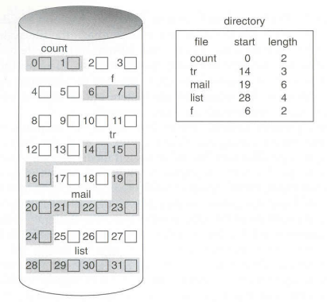
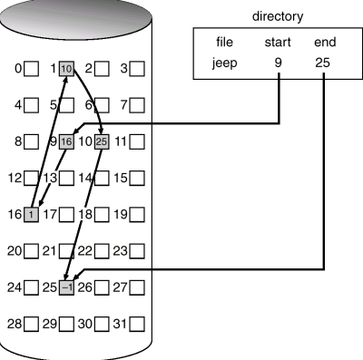
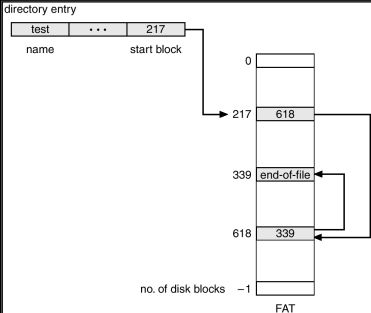
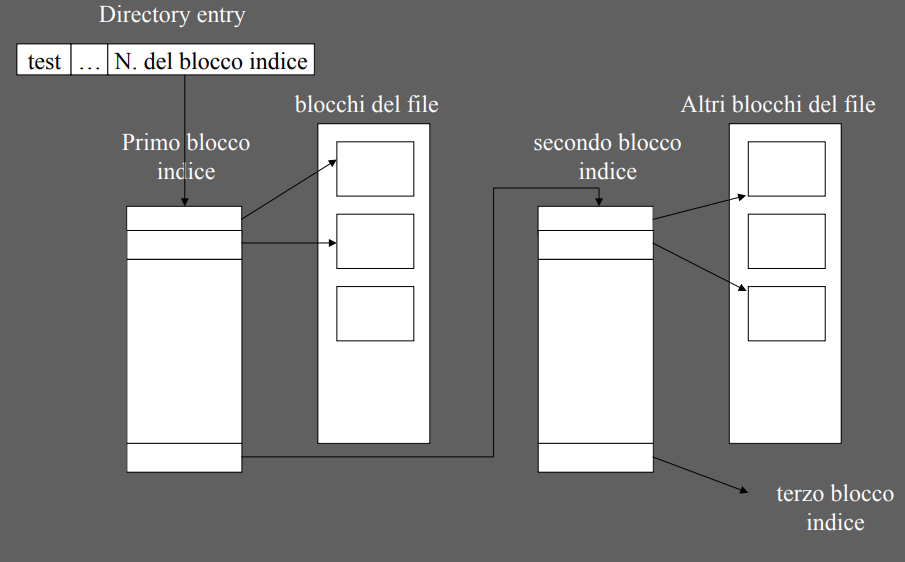
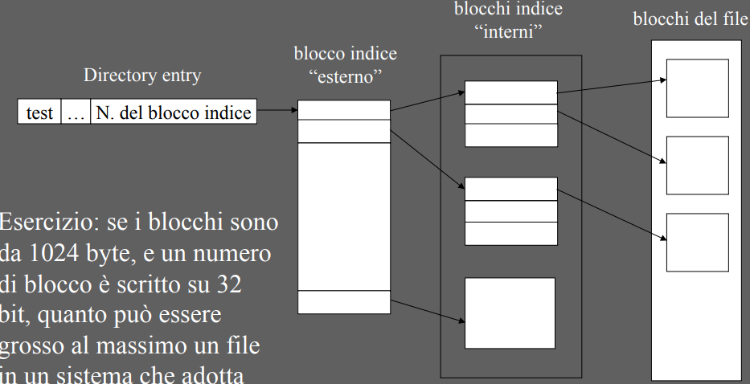

### Allocazione dei file
Ogni file viene memorizzato dal SO nei blocchi dell'HD, e se questo(il file) supera la dimensione di un blocco, viene distribuito su più blocchi.
Inoltre per ogni file, il SO deve mantenere una struttura interna dove memorizzare i dati essenziali di ogni file(attributi,permessi etc)

Esistono principalmente tre metodi per l'allocare spazio sull'HD per i file:

1. **Allocazione contigua**
2. **Allocazione Concatenata**
3. **Allocazione indicizzata**

#### Allocazione contigua
Ogni file viene allocato dal SO in un insieme di blocchi **contigui** dell'HD.
Per recuperare i dati del file basta dunque memorizzare,tra gli attributi del file:
- Numero del primo blocco del file
- Quanti blocchi occupa quel dato file(anche se ciò non è strettamente necessario visto che, tra i vari attributi del file, viene anche registrata la dimensione del file).

##### Pro
- **Accesso** ai vari blocchi del file **veloce e semplice**. Noto il primo blocco del file, per recuperare l'*n-esimo* byte, è facile calcolare quale blocco leggere.
- **Poche informazioni da registrare** per sapere quale parte del HD è occupata dal file. 
   Basta memorizzare il numero del primo blocco e la sua grandezza

##### Contro
Gli svantaggi di una **allocazione contigua** sono simili a quelli della Memoria Primaria:
- Per allocare un file bisogna trovare abbastanza **blocchi adiacenti** da poter contenere tutto il file
- Necessità di adottare una **strategia di scelta del buco libero** (first/best/worst fit)
- Disco soggetto a **frammentazione esterna** 
- Visto che il disco è soggetto a frammentazione esterna, bisogna effettuare periodicamente una **ricompattazione** del disco (operazione molto lenta)
- Se la dimensione di un file aumenta, siamo costretti a
	- **Riallocare il file**, operazione tuttavia molto costosa visto che bisogna leggere e riscrivere i blocchi dell'HD
	- In alternativa, si potrebbe sovradimensionare il file, però in questo caso si presenterebbe anche la **frammentazione interna**

#### Allocazione concatenata
Nell'**allocazione concatenata** viene costruita una catena di blocchi contenenti i dati dei file: ogni blocco conterrà un puntatore al blocco successivo:il numero del blocco in cui prosegue il file.
Per **risalire ai vari blocchi** che contengono il file basta memorizzare, tra gli attributi del file, il numero del blocco iniziale. Si può anche, in alternativa, memorizzare il numero di blocchi usati e/o il numero del blocco finale.
Nell'ultimo blocco, nello spazio per memorizzare il numero del blocco successivo, viene impostato un **valore negativo**(o anche 0)a indicare che è l'ultimo blocco del file

##### Pro
- Nessuna necessità di blocchi contigui, quindi 
	- niente **frammentazione esterna**
	- non c'è bisogno di ricompattare il disco

- Qualsiasi blocco libero può essere utilizzato per memorizzare una porzione del file

##### Contro
- Bisogna **salvare** in ogni blocco una **ulteriore informazione**: il numero al blocco successivo
   Tuttavia **non è un problema troppo grave**, dal momento che son solo pochi byte.
   *es.* In caso di blocchi da 512 byte, con 4 byte per puntatore, soltanto lo 0.78% 
		    di un blocco non può essere utilizzato per memorizzare dati del file
			Dunque uno spreco tutto sommato accettabile.
- Il problema principale è **l'accesso diretto** al file; può risultare **altamente inefficiente**
	 - Sono necessari **n accessi** al disco per accedere  all'**n-esimo** blocco
	 - Sistema di allocazione è **poco affidabile**. Se un blocco del file viene danneggiato, si perde tutta la parte di file a parte dal blocco danneggiato in avanti

##### Soluzioni alla inaffidabilità
- Usare **liste doppiamente concatenate**: se si danneggia un blocco possiamo recuperare i blocchi successivi ripercorrendo la catena dall'indietro.
  Bisogna inoltre memorizzare un **puntatore aggiuntivo** per ogni blocco 
- Memorizzare in ogni blocco il nome del file e la posizione all'interno della catena
- Non usare blocchi singoli ma considerare tutto l'HD formato da **cluster di blocchi adiacenti**

#### Allocazione concatenata versione FAT
Sebbene l'allocazione concatenata presenti gravi difetti, una sua variante era comunque usata nei sistemi ms-dos ed è tutt'ora disponibile nei sistemi Windows come alternativa a NTFS

#### File Allocation Table (FAT)
E' un'**area all'inizio del disco**(un array) in cui l'indice di ogni entry corrisponde ad un blocco e contiene il numero di un blocco.
Se un'entry contiene il valore 0, allora quel blocco sarà **libero**.
Se una entry punta al blocco finale di un file, questa conterrà un **marker speciale** di fine file.
Inoltre bisogna anche aggiungere tra gli attributi del file il numero del primo blocco che contiene i dati del file

##### Pro
- Mettendo la **FAT** in RAM, l'accesso diretto ai file, migliora sensibilmente.
   Per risalire all'*n-esimo* blocco, basta leggere nella RAM la FAT
- Il sistema è **più sicuro** in caso di perdita di un blocco, visto che la catena di blocchi è riprodotta nella FAT
- **Gestione dei blocchi liberi automatica**: ogni entry della FAT che contiene 0 rappresenta un blocco libero
##### Contro
- La FAT **occupa spazio in RAM**, infatti durante l'uso di essa, sottrae spazio ad altri processi
- Più aumentano le dimensioni medie degli HD, più l'uso della FAT diventa problematico
- Bisogna frequentamente salvare la FAT sul HD dal momento che se viene persa non c'è più modo di accedere ai dati dei vari file

#### Allocazione indicizzata
Nell'allocazione indicizzata, il numero di ogni blocco di cui è composto il file viene scritto in un apposito blocco chiamato **blocco indice**. Notare che dunque bisogna salvare un'informazione aggiuntiva tra gli attributi del file: il **numero del blocco indice**.
Questo sistema è simile all'utilizzo di una Page Table per quanto riguarda la Memoria Primaria.

##### Pro
- **Nessuna frammentazione esterna:** non c'è bisogno di blocchi contigui
- **Accesso diretto efficiente:** una volta portato in RAM il blocco indice, calcolarsi quale blocco contiene quale byte è abbastanza facile

##### Contro
- Se un file è piccolo, il **blocco indice** risulterà quasi tutto **sprecato**

#### Varianti dell'allocazione indicizzata
Un blocco indice potrebbe essere non sufficiente per tener traccia di tutti i blocchi di cui è composto il file. 
Bisogna dunque modificare il tipo di approccio:

1. **Schema concatenato**
	
2. **Schema a più livelli**
	

#### i-node Unix
Un'ulteriore variante dell'allocazione indicizzata è quella usata sui sitemi Unix: ad ogni file viene associato un blocco indice(**i-node** -> index node) che contiene gli **attributi del file** e **l'elenco  dei blocchi di dati del file**.
Ogni i-node viene gestito direttamente dal SO e salvato in un'area riservata dell'HD.
Nell'**i-node** vengono inoltre memorizzati:
- 10 **puntatori diretti** a blocchi di dati del file
- 1 **puntatore single indirect** che punterà ad un blocco indice che conterrà puntatori a blocchi di dati del file
- 1 **puntatore double indirect** che punterà ad un blocco indice che conterrà  puntatori a blocchi indice ognuno dei quali conterrà puntatori a blocchi di dati del file
- 1 **puntatore triple indirect** che punterà ad un blocco indice che conterrà puntatori a blocchi indice ognuno dei quali conterrà puntatori a blocchi indice ognuno dei quali conterrà puntatori a blocchi di dati del file

#### NTFS 