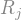
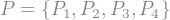
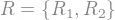
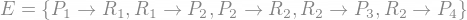

# DeadLock

É una situazione per cui un **insieme di processi** sono fermi in **attesa** di un evento che solo uno dei processi appartenenti all'insieme stesso potrebbe causare.

E' un problema di **sincronizzazione** dipendente dalle specifiche esecuzioni dei vari processi.

Se un processo,richiedente una risorsa, la trova occupata, entra in uno stato di attesa. Puó capitare che questa peró non cambi mai stato, poiché altri processi in attesa attendono la stessa risorsa. 

Si verifica il DeadLock se:
- Le risorse sono in **mutua esclusione**
	- Solo un processo alla volta puó usare una risorsa
- Le risorse sono in **possesso e attesa**:
	- Se detengono il possesso di alcune risorse e ne attendono altre
- É presente un'**attesa circolare**
	- Un processo attende una risorsa, occupata da un'altro che attende un'altra risorsa, e cosí via
- Non c'è **prelazione** (il SO non puo' sottrarre risorse per riassegnarle)

Basta che **una** delle **condizioni** sopra citate non si verifichí per **evitare** il deadlock.

## Grafi di assegnazione delle risorse
Per rappresentare piú precisamente il deadlock utilizziamo i **grafi di assegnazione delle risorse**.

Sono grafi della forma , dove :
-  é l'insieme dei **vertici**. A sua volta é partizionato in 2 tipi di nodi:
	-  é l'insieme dei processi attivi
	-  é l'insieme dei tipi di risorse presenti nel sistema
-  é l'insieme degli archi:
	- un'arco da un processo ad una risorsa  indica una richiesta di una risorsa di tipo  da parte del processo  ed é definito **arco di richiesta**
	- un'arco da una richiesta ad una risorsa  indica l'assegnazione di una risorsa di tipo  al processo  ed é definito **arco di assegnazione**

Un gradi di assegnazione puó essere composto nella seguente maniera:	
-	
-	
-	
e rappresentato nella seguente:


### Utilizzo dei grafi per la localizzazione del deadlock
Possiamo definire delle regole generali per l'individuazione del deadlock a partire dai grafi:
- Se **non** sono presenti **cicli** non é neanche presente il deadlock
- La presenza di un **ciclo** é una condizione **necessaria ma non sufficiente** al verificarsi del deadlock:
	- Se nel ciclo sono presenti solo **risorse** aventi una **sola istanza** allora é sicuramente presente il deadlock
	- Se nel ciclo sono presenti piú istanze di una risorsa non é detto che ci sia deadlock, in quanto basta che una delle risorse sia soddifacibile per rompere il ciclo

## Gestione del Deadlock
Dando per scontato che é importante individuare il deadlock se non abbiamo modi di evitare che si verifichi a priori, generalmente lo si puó gestire in **3 maniere**:
- Si puó introdurre un **protocollo** per **prevenire** o **evitare** il deadlock
	- Bisogna definire opportuni protocolli di assegnazione delle risorse
- Possiamo permettere al sistema di entrare in uno stato di deadlock, **individuarlo** e **risolverlo**
	- Richiede la capacitá di monitorare le richieste e l'assegnazione delle risorse
- Possiamo **ignorare il problema** e pretendere che non avvenga mai nel sistema
	- É la tecnica piú utilizzata, poiché non richiede risorse o pilitiche particolari 

Per assicurarci che il deadlock non si verifichi mai possiamo usare 2 strategie: **Deadlock Avoidance** strategies o **Deadlock Prevention** strategies.

### Deadlock Prevention
Affiché il deadlock si verifichi é necessario che ognuna delle 4 condizioni sopra citate si verifichino. 

Assicurandoci che almeno **una** di queste **non si verifichi** , prossiamo prevenire il deadlock
#### Strategie di Havender
##### Prima strategia: Possesso e attesa
Per assicurarci che la condizione di possesso e attesa non si verifichi mai, bisogna assicurarsi che quando il processo richiede delle risorse, non ne possieda nessun'altra.

Al fine di evitare il deadlock si possono quindi **richiedere** tutte le **risorse** necessarie all'esecuzione del processo **in una solo volta** e :
- Se sono **tutte disponibili**, queste vengono **assegnate** e si prosegue con l'esecuzione
- **Altrimenti**, il processo non ne acquisisce nessuna e si mette in **attesa**

Questa strategia é molto **dispendiosa** in termini di **risorse**, in quanto molti **processi** potrebbero rimanere in **attesa** di una risorsa presente in singola istanza.

Peró se all'interno di un processo riusciamo a distinguere piú **thread**, ciascuno dei quali ha bisogno solo di un sottoinsieme di risorse ed e'generato all'occorrenza, la strategia puó risultare **efficace**.

##### Seconda strategia: Prelazione
Per consentire la prelazione, quando un processo waiting detiene alcune risorse,se gli viene **negato** l'accesso alla risorsa di cui necessita, le **risorse** che ha accumulato vengono **implicitamente rilasciate**.

Questa trategia é molto **costosa**, in quanto un processo potrebbe perdere il lavoro effettuato fino a quel momento, quindi deve essere applicata solo **di rado** per poter essere utile.

##### Terza strategia: Attesa Circolare
Un modo per evitare l'attesa circolare é imporre un'ordinamento dei tipi di risorse e richiedere che ogni processo richieda le risorse in ordine crescente.

In questo modo non si puó avere deadlock poiché l'ordinamento delle risorse impedisce l'attesa circolare.

### Deadlock Avoidance
Non sempre é possibile prevenire il deadlock, imponendo limiti a come le richieste si possono effettuare. 

É comunque possibile evitare il deadlock richiedendo **informazioni aggiuntive**, per esempio l'ordine e la quantitá delle richieste dei processi.

Conoscendo la sequenza di richieste e rilasci delle risorse, il sistema puó decidere quali processi devono attendere, per evitare il deadlock.

Conoscendo queste informazioni possiamo andare a costruire un'**algoritmo** che ci assicura che il sistema non entri in uno stato di deadlock, analizzando lo stato di **allocazione delle risorse** e assicurandosi che non si verifichi attesa circolare.

Lo stato di allocazione delle risorse é definito a partire dal numero di risorse disponibili ,allocate e dalla domanda massima dei processi. 


#### Stato sicuro
Il sistema si trova in uno stato sicuro se il sistema puó allocare risorse per ogni processo grantendo la loro esecuzione in un tempo finito senza causare deadlock.

Piú precisamente, uno stato  e' sicuro se esiste una **sequenza sicura** che diparte da esso.

#### Sequenza sicura
Una sequenza si definisce sicura quando per ogni processo appartenente alla sequenza, le richieste del processo possono essere **soddisfatte** utilizzando le **risorse** che sono **libere**  piu' tutte quelle **liberate** da tutti i **processi precedenti**.

Finché il sistema di processi che condividono risorse rimane in uno stato sicuro il SO può evitare il verificarsi del deadlock

#### Algoritmo di Deadlock avoidance con un'istanza per risorsa
Per introdurre questo algoritmo introduciamo prima un'altro tipo di grafo
##### Archi di reclamo 
Un'arco di reclamo  indica che il processo  potrebbe chiedere la risorsa  in futuro.

Graficamente viene rappresentata con una **freccia tratteggiata**. 

Quando la richiesta viene effettuata questa viene **convertita** in un'arco di richiesta.

All'inizio tutti i processi inseriscono nel grafo di assegnazione un claim edge per ciascuna risorsa di cui avranno bisogno.

Sará possibile poi trasformare gli archi di reclamo in archi di richieste soltanto se viene a generarsi un ciclo costituito da qualunque tipo di archi.


#### Algoritmo del banchiere
L'algoritmo descritto al punto precedente non é valido se sono presenti istanze multiple di ogni risorsa. Per questo usiamo un'algoritmo piú generale chiamato **Algoritmo del banchiere**.

Quando un processo entra nel sistema, deve dichiarare il numero **massimo** di istanze di **ogni risorsa** di cui potrebbe necessitare, per poter permettere al sistema di determinare se la sua esecuzione lascierebbe il sistema in uno stato sicuro.

Per implementare l'algoritmo del banchiereabbiamo bisogno di diverse strutture dati, dove $n$ é il **numero** di **processi** e $m$ il numero dei tipi di** risorse** presenti nel **sistema**:
- **Disponibili[m]**
	- Indica il numero di risorse disponibili per tipo
- **Massimo[n][m]**
	- Indica la richiesta massima di ciascun processo per ogni tipo di risorsa
- **Assegnate[n][m]**
	- Indica quante risorse di ciascuna classe sono assegnate a ogni processo
- **Necessarie[n][m]**
	- Indica quante risorse di ciascun tipo ancora mancano ai vari processi

##### Nota
Dati due vettori di uguale lunghezza X e Y si indica con X < Y il fatto che per ogni indice i X[i] < Y[i], si indica con X ≤ Y il fatto che per ogni indice i X[i] ≤ Y[i] e si indica con Z = X + Y il fatto che per ogni indice i Z[i] = X[i] + Y[i]

L'algoritmo é diviso in 2 parti

##### Algoritmo di verifica della sicurezza
```text
Lavoro[m]
Disponibili[n]
Lavoro = Disponibili && Fine[i] = falso, per ogni i∈[1,n]
Find index in(i∈[1,n]):
	//Controllo se il processo non é terminato e se le risorse disponibili sono minori alle disponibili 
	if(Fine[i]==false && Necessarie[i]≤Lavoro){
		//Assegno le risorse ed incremento lavoro poiché le risorse del processo al suo termine saranno nuovamente disponibili
		Lavoro = Lavoro + Assegnate[i]
		Fine[i] = true
	}
if(per ogni i∈[1,N], Fine[i]==true){
	//se ogni processo ha terminato il proprio lavoro lo stato é sicuro
	stato=sicuro
}
```
L'algoritmo ha complessitá 

##### Algoritmo di allocazione delle risorse
```text
if(Richieste[i]<=Necessarie[i])//Se la richiesta é soddisfacibile
	if(Richieste[i]<=Disponibili)
		//Fingiamo di allocare le risorse
		Disponibili=Disponibili-Richieste[i]
		Assegnate[i]=Assegnate[i]+Richieste[i]
		Necessarie[i]=Necessarie[i]-Richieste[i]
		if(stato==sicuro)
			//Alloco veramente le risorse
		else
			wait()
	else
		wait()
```