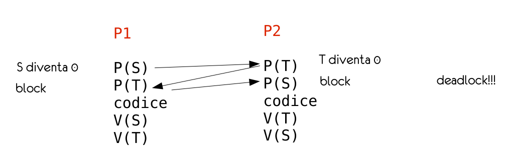
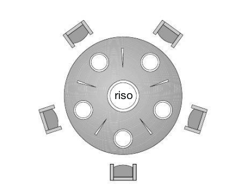
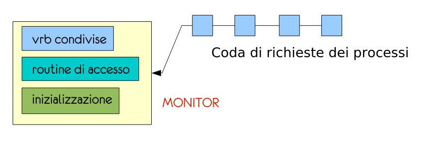
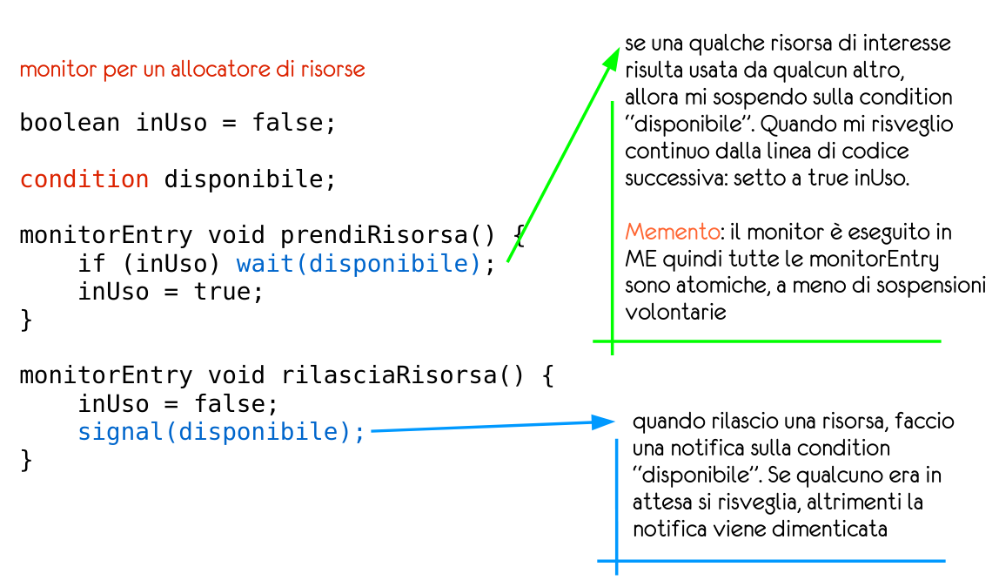

# Sincronizzazione dei processi

## Problema della selezione critica
Si consideri un sistema composto da $n$ processi $\{ P_0,P_1,...P_{n-1}\}$. La porzione di **codice** al loro interno che può **modificare variabili comuni** è detta **sezione critica**. Quando uno dei processi $P$ entra nella sua sezione critica non si consente a nessun'altro processo di entrare nella propria. 

Dunqua ogni processo deve chiedere il permesso per entrare in questa sezione critica.
es:
```java
while (true) {
	SEZIONE_D_INGRESSO();
	 /* sezione critica */
	SEZIONE_D_USCITA():
	/* sezione non critica */
}
```
Il **codice** di un **processo** che presenta il problema della **selezione critica** è composto così:
- ***Sezione di ingresso***: sezione dove si realizza la richiesta d'accesso alla sezione critica
- ***Sezione d'uscita***: sezione che separa la zona critica da quella non critica

Una soluzione al problema della selezione critica deve sodisfare dei requisiti precisi:
- ***Mutua esclusione***: Se un processo $P_i$ è in esecuzione nella sua sezione critica **nessun altro** processo può essere in esecuzione nella sua sezione critica.
- ***Progresso***: Se nessun processo è in esecuzione nella propria sezione critica la **decisione** di quale **processo** deve entrare per **primo** va effettuata immediatamente e non può essere rimandata .
- ***Attesa limitata***: Se un processo ha già richiesto di entrare nella propria sezione critica esiste un numero massimo di volte che si consente ad altri processi di superarlo.

Le due strategie principali per la gestione delle sezioni critiche sono i:
1. kernel **con** diritto di **prelazione**:
	consente che un processo funzionante in modalità di sistema sia sottoposto a prelazione, rinviandone in tal modo l’esecuzione.
2. kernel **senza** diritto di **prelazione**:
	non consente di applicare la prelazione a un processo attivo in modalità di sistema: l’esecuzione di questo processo seguiterà finché lo stesso esca da tale modalità, si blocchi o ceda volontariamente il controllo della CPU.
---
## Soluzione di Peterson
Soluzione di Peterson è limitata a due processi $P_i$ e $P_j$ che si alternano nell'eseguire la propria sezione critica.

I processi condividono i seguenti dati:
```java
int turn;
boolean flag[2]; 
```
- La variabile **turn** può essere `turn = i` oppure `turn = j` in base a chi sta eseguendo la propria sezione critica.
- L'array **flag** indica se un processo sia *pronto* a entrare nella propria sezione critica. es. `flag[i] = true` allora $P_i$ è pronto ad entrare nella sezione critica.

Un esempio dell'algoritmo utilizzando la soluzione di peterson può essere questo:
```java
while(true){
	flag[i] = true;
	turn = j;
	while (flag[j] && turn == j){
	/* sezione critica */
	flag[i] = flase;
	}
	/* sezione non critica */
}
```
---
## Hardware per la sincronizzazione
Soluzioni software come quella di Peterson non garantiscono il loro funzionamento in architetture moderne.
- In sistemi con *una sola CPU* la selezione critica si può risolvere **disabilitando gli interrupt** per impedire il context switch, il problema è che in sistemi con più cpu questo risulterebbe in attese troppo lunghe e uno spreco di risorse inaccettabile.
- Un'alternativa è l'introduzione di **lock**. Un processo deve avere ottenuto il giusto lock, che rilascia al termine. A questo fine molte architetture forniscono istruzioni che consentono di controllare alcune parole di memoria in modo **atomico**.
- Una soluzione proposta è quella dell'utilizzo di `TestAndSet` e `Swap` che nella forma sotto proposta non risolvono il problema del **busy waiting**, che però è risolto con un implementazione più complicata dell'algoritmo.

- *Implementazione di `TestAndSet`:*
	```c
	boolean TestAndSet (boolean *variable) {
		boolean valore = *variable;
		*variable = true;
		return valore;
	}
	```
	`TestAndSet` viene usato in questo modo:
	```c
	while(TestAndSet(&lock)){ /* <-- sezione d'ingresso */
	/* sezione critica */
	lock = false;
	}
	/* sezione non critica */
	```
- *Implementazione di `Swap`:*
	```c
		void Swap (boolean *a, boolean *b) {
			boolean temp;
			temp = *a;
			*a = *b;
			*b = temp;
		}
	```
	`Swap` viene usato in questo modo:
	```c
	chiuso = true;
	while (chiuso) {
		Swap(&lock, &chiuso);
		/* sezione critica */
		lock = false;
	}
	/* sezione non critica */
	```
---
## Mutex lock
Un processo deve acquisire il lock prima di entrare in una sezione critica e rilasciarlo quando esce dalla stessa.
es.
```java
while(true){
acquire();
	/* sezione critica */
release();
	/* sezione non critica */
}
```
- `acquire()` acquisisce il lock
- `release()` rilascia il lock
Un mutex lock ha una variabile booleana che indica se il lock è disponibile o meno.
- definizione di `acquire`:
	```java
	void acquire() {
		while(!available){
			/* attesa attiva / busy waiting */
		}
	}
	```
- definizione di `release`:
	```java
	void release(){
		available = true;
	}
	```
Le chiamate a `acquire` e `release` devono essere atomiche.

Lo svantaggio principale è che richiede **busy waiting**, questo tipo di implementazione dei lock mutex è detta anche **spin lock** perché il processo che rimane in attesa di entrare nella sua sezione critica continua a girare in attesa che il lock diventi disponibile.
Gli spinlock hanno però il vantaggio di non rendere necessario nessun context switch e vengono quindi comunemente usati in sistemi multi core mentre sono un evidente problema in sistemi single core.
/---
## Semafori
Un **semaforo** $S$ è una variabile cui si può accedere solo tramite due operazioni atomiche, `wait` (detta `P`) e `signal` (detta `V`).

Esistono principalmente 2 tipi di semafori:
- **semafori contatore** il cui valore è un numero intero;
- **semafori binari** il cui valore è 0 oppure 1.

Quando un semaforo ha valore `0` tutte le risorse sono occupate e i processi che vogliono accedere ad esse devono aspettare fin che il semaforo non torni positivo.

*Le operazioni `P` e `V` in dettaglio:*
- `P()` $\longrightarrow$ decrementa il valore bloccando la risorsa (nei semafori contatore) o ne inverte il valore (nei semafori binari)
	```java
	void P(S){
		while(S <= 0){
			/* attesa attiva */
		}
		S--;
	}
	```
- `V()` $\longrightarrow$ incrementa il valore liberando la risorsa
	```java
	void V(S){
		S++;
	}
	```
### Semafori con code
Possibile implementazione:
```c
struct semaforo {
	int valore;	/* <-- valore del semaforo */
	processo *lista: /* lista di attesa relativa al semaforo */
}

P(semaforo *s) {
	s -> valore--; /* decremento il valore del semaforo */
	if (s->valore < 0){ /* se il valore diventa negativo occorre sospendere il processo */
		/* aggiungo PCB di questo processo a s->lista */
		block(); /* block è una system call che richiama lo scheduler della CPU,
					che deve riassegnare la medesima a un altro processo,e il 
					dispatcher, che deve effettuare il context switch */
	}
}

V(semaforo *s) {
	s->valore++; /* incremento il valore del semaforo */
	if (s->valore<0) { /* se il valore è negativo allora ci sono processi da risvegliare */
		/* scegli un PCB da s->lista */
		wakeup(p) /* wakeup è una sistem call che rende il processo p ready */
	}
}
```

### Tipi di sincronizazione
- **Mutua esclusione**: tutti i processi coinvolti parentesizzano le loro sezioni critiche con `P(mutex)` ... `V(mutex)`, dove `mutex` è un semaforo binario (detto anche a mutua esclusione).
- **Accesso limitato**: tutti i processi coinvolti parentesizzano le loro sezioni critiche con `P(nris)` ... `V(nris)`. `nris` è uguale al numero di accessi contemporanei alla risorsa.
### Deadlock
Siano `P1` e `P2` due processi e questo il loro codice:

Sará trattato piú approfonditamente nelle sezioni successive.

---
## Tipici problemi di sincronizzazione
### Produttore/consumatore con memoria limitata
Nel nostro problema produttore e consumatore condividono le seguenti strutture dati:
```c
int n;
semaphore mutex = 1;
semaphore empty = n;
semaphore full = 0
```
La struttura generale del **processo produttore** è:
```c
while(true){
	/* produce un elemento in next_produced */
	wait(empty);
	wait(mutex);
	/* inserisci next_produced in buffer */
	signal(mutex);
	signal(full);
}
```
La struttura generale del **processo consumatore** è:
```c
while (true){
	wait(full);
	wait(mutex);
	/* rimuovi un elemento da buffer e mettilo in next_consumed */
	signal(mutex);
	signal(empty);
	/* consuma l’elemento contenuto in next_consumed */
}
```
Si supponga di disporre di una certa quantità di memoria rappresentata da un buffer con n posizioni, ciascuna capace di contenere un elemento. 

Il semaforo mutex garantisce la mutua esclusione degli accessi al buffer ed è inizializzato al valore 1. I semafori vuote e piene conteggiano rispettivamente il numero di posizioni vuote e il numero di posizioni piene nel buffer. Il semaforo vuote si inizializza al valore n; il semaforo `piene` si inizializza al valore 0. È interessante notare la simmetria esistente tra il produttore e il consumatore. Il codice si può interpretare nel senso di produzione, da parte del produttore, di posizioni piene per il consumatore; oppure di produzione, da parte del consumatore, di posizioni vuote per il produttore.

### Problema dei lettori-scrittori
Si supponga che una base di dati sia da condividere tra numerosi processi concorrenti.
Alcuni processi possono richiedere solo la lettura del contenuto della base dati, mentre altri ne possono richiedere un aggiornamento, vale a dire una lettura e una scrittura.
Questi due tipi di processi vengono distinti chiamando lettori quelli interessati alla sola lettura e scrittori gli altri. 
Naturalmente, se due lettori accedono nello stesso momento all’insieme di dati condiviso, non si ha alcun effetto negativo; viceversa, se uno scrittore e un altro processo (lettore o scrittore) accedono contemporaneamente alla stessa base di dati, ne può derivare il caos.

Per impedire l’insorgere di difficoltà di questo tipo è necessario che gli scrittori abbiano un accesso esclusivo in fase di scrittura alla base di dati condivisa. Questo problema di sincronizzazione è conosciuto come problema dei lettori-scrittori. Da quando tale problema fu enunciato, è stato usato per verificare quasi tutte le nuove primitive di sincronizzazione. 

Il problema dei lettori-scrittori ha diverse varianti, che implicano tutte l’esistenza di priorità; la più semplice, cui si fa riferimento come al primo problema dei lettori-scrittori, richiede che nessun lettore attenda, a meno che uno scrittore abbia già ottenuto il permesso di usare l’insieme di dati condiviso. 

In altre parole, nessun lettore deve attendere che altri lettori terminino l’operazione solo perché uno scrittore attende l’accesso ai dati. Il secondo problema dei lettori-scrittori richiede che uno scrittore, una volta pronto, esegua il proprio compito di scrittura al più presto. In altre parole, se uno scrittore attende l’accesso all’insieme di dati, nessun nuovo lettore deve iniziare la lettura.
La soluzione del primo problema e quella del secondo possono condurre a uno stato d’attesa indefinita (starvation), degli scrittori, nel primo caso; dei lettori, nel secondo.
La soluzione del primo problema dei lettori-scrittori prevede dunque la condivisione da parte dei processi lettori delle seguenti strutture dati:
```c
semaphore rw_mutex = 1;
semaphore mutex = 1;
int read_count = 0;
```
Mentre la struttura generale di un processo lettore è:
```c
while(true){
	wait(rw_mutex);
	/* esecuzione dell'operazione di scrittura */
	signal(rw_mutex);
}
```
Il semaforo `mutex` si usa per assicurare la mutua esclusione al momento dell’aggiornamento di `read_count`. La variabile read_count contiene il numero dei processi che stanno attualmente leggendo l’insieme di dati. Il semaforo `rw_mutex` funziona come semaforo di mutua esclusione per gli scrittori e serve anche al primo o all’ultimo lettore che entra o esce dalla sezione critica. Non serve, invece, ai lettori che entrano o escono mentre altri lettori si trovano nelle rispettive sezioni critiche.
Occorre notare che se uno scrittore si trova nella sezione critica e n lettori attendono di entrarvi, si accoda un lettore a `rw_mutex` e $n – 1$ lettori a mutex. Inoltre, se uno scrittore esegue `signal(rw_mutex)` si può riprendere l’esecuzione dei lettori in attesa, oppure di un singolo scrittore in attesa. La scelta è fatta dallo scheduler.

### Problema dei cinque filosofi (dining philosophers)
Si considerino cinque filosofi che trascorrono la loro esistenza pensando e mangiando. I filosofi condividono un tavolo rotondo circondato da cinque sedie, una per ciascun filosofo. Al centro del tavolo si trova una zuppiera colma di riso, e la tavola è apparecchiata con cinque bacchette (chopsticks). 

Quando un filosofo pensa, non interagisce con i colleghi; quando gli viene fame, tenta di prendere le bacchette più vicine: quelle che si trovano tra lui e i commensali alla sua destra e alla sua sinistra. Un filosofo può prendere una bacchetta alla volta e non può prendere una bacchetta che si trova già nelle mani di un suo vicino. Quando un filosofo affamato tiene in mano due bacchette contemporaneamente, mangia senza lasciare le bacchette. Terminato il pasto, le posa e riprende a pensare.
Una semplice soluzione consiste nel rappresentare ogni bacchetta con un semaforo: un filosofo tenta di afferrare ciascuna bacchetta eseguendo un’operazione `wait()` su quel semaforo e la posa eseguendo operazioni `signal()` sui semafori appropriati. Quindi, i dati condivisi sono:
```c
semaphore chopstick[5];
```
Mentre la struttura del filosofo $$i$$ è:
```c
while (true){
	wait(chopstick[i]);
	wait(chopstich[i+1]%5);
	/* mangia */
	signal(chopstick[i]);
	signal(chopstick[(i+1) % 5]);
	/* pensa */
}
```
dove tutti gli elementi chopstick sono inizializzati a 1.
Questa soluzione garantisce che due vicini non mangino contemporaneamente, ma è insufficiente poiché non esclude la possibilità che si abbia una situazione di stallo. Si supponga che tutti e cinque i filosofi abbiano fame contemporaneamente e che ciascuno afferri la bacchetta di sinistra; tutti gli elementi di chopstick diventano uguali a zero, perciò ogni filosofo che tenta di afferrare la bacchetta di destra entra in stallo. 
Tali situazioni di stallo possono essere evitate con i seguenti espedienti:
- solo quattro filosofi possono stare contemporaneamente a tavola;
- un filosofo può prendere le sue bacchette solo se sono entrambe disponibili (quest’operazione si deve eseguire in una sezione critica);
- si adotta una soluzione asimmetrica: un filosofo dispari prende prima la bacchetta di sinistra e poi quella di destra, invece un filosofo pari prende prima la bacchetta di destra e poi quella di sinistra.

---
## Monitor
Si può immaginare una call a un monitor come una coda di messaggi che vengono elaborati uno alla volta. Il monitor riceverà un messaggio e cercherà di portare a termine la richiesta come definito nella procedura nei suoi parametri di input. 
- Se la richiesta può essere immediatamente soddisfatta allora il monitor la soddisferà immediatamente permettendo quindi al processo di continuare. 
- Se la richiesta non può essere soddisfatta immediatamente il monitor non permetterà al programma di continuare la sua esecuzione e metterà la richiesta dello stesso dentro una coda.
Questo modus operandi permette al monitor di leggere la queue e decidere quale richiesta completare per prima. La coda è evidentemente locale al monitor, quindi non modificabile da altri processi.

*esempio:*


